# Milestone: Report

## The problem your bot solved

While traditional on-prem hardware was managed by a dedicated IT staff, the cloud based model relies more on the developer to manage his own resources bringing us to the common pain point that is provisioning of VMs. The entire process of spinning up VMs, provisioning and configuring them involves major command line bullshitery and tends to be a monotonous and time wasting task, laden with scope for messing up. The process is made multiplicatively more tiring when having to spin up entire clusters for various Big-Data or distributed applications. Often infrastructure is spread across multiple cloud providers to avoid vendor lock-in. This gives rise to other problems like having to deal with different pricing models and multiple authentication tokens.

Although DevOps practices have made this a lot more manageable in recent times, our approach takes this a step further providing an appliance like service for cloud provisioning through a Slack-bot. Such a solution while isolating the user from all the above mentioned issues, also helps in offloading the trivial tasks of finding the lowest pricing for the required resource, tracking utilization, potentially sharing already allocated resources with peers, etc. Not does this afford the user greater ease of use *(allowing him to procure resources from a smartphone, while driving to work)* but also help the company save a load of cash by means of resource tracking and enabling ubiquitous access *(think of that one user who forgot to shut down his cluster before a long vacation)*.

## Primary features and screenshots

### Pre-requisites

One needs to generate credentials for their AWS/ Digital Ocean. They also need to generate keypair on AWS [AWS - Getting Started](https://aws.amazon.com/documentation/) or ssh key on Digital Ocean [Digital Ocean - Getting Started](https://www.digitalocean.com/help/). In case one wants to set up a Spark cluster, they will need to activate their AWS account for Amazon EMR.

### Save keys

This feature is an initial one-time setup where in a user provides necessary keys for provisioning. The bot tests if provided credentials for the cloud provider are valid and subsequently saves the keys for the service (like AWS or Digital Ocean). This would be a one time setup and would be used for all VM and cluster creation requests.

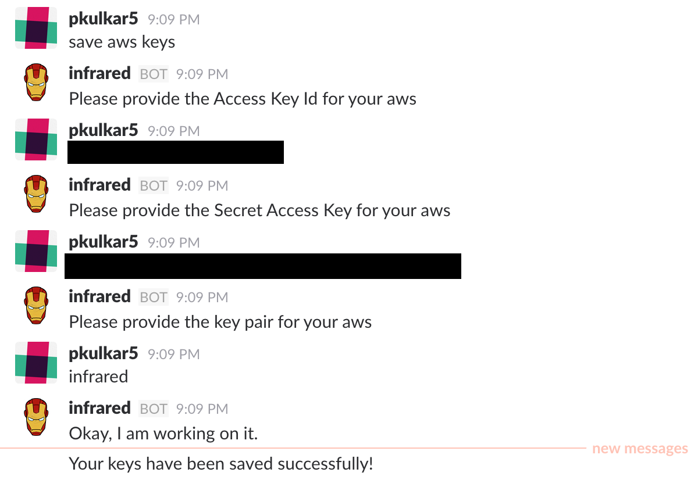

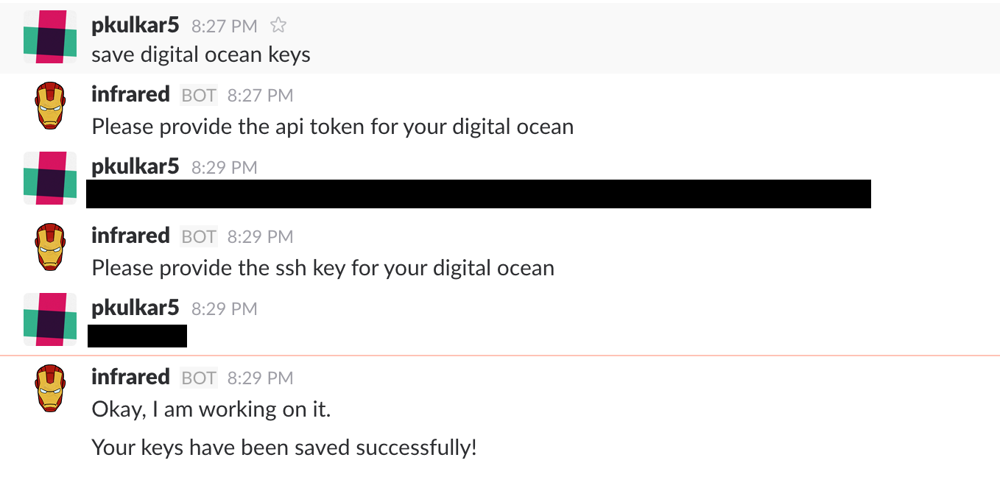

### Create VM

Once the keys have been setup, the user can request creation of VMs. User can specify the configuration parameters as a long-tailed or short-tailed requests. The provisioning service is smart enough to pick the closest matching config with the lowest price if keys have been set up for different providers. User is provided with the IP address to connect to and also presented with the Reservation Id created by the service provider.

This config results in creation of vm on AWS

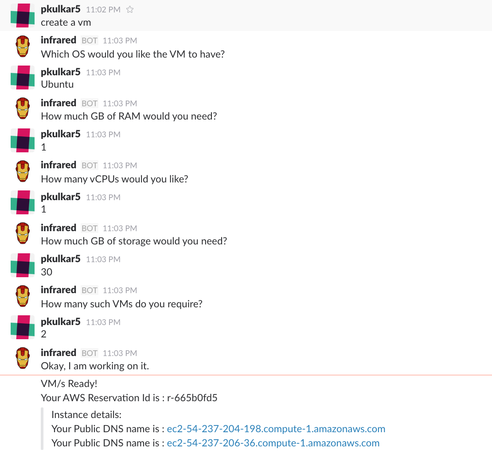

This config results in creation of vm on Digital Ocean

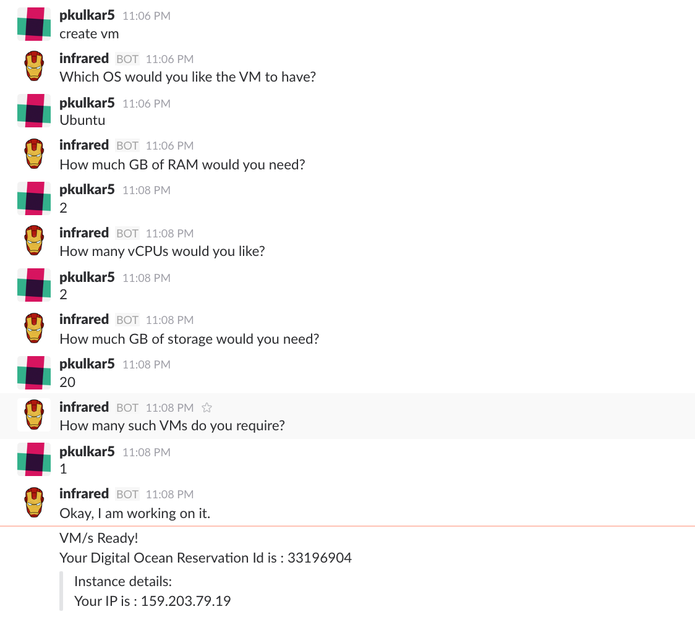

### Show reservations

One can view all their active reservations if any. The configuration parameters as part of the request are displayed to the user by Infrared.

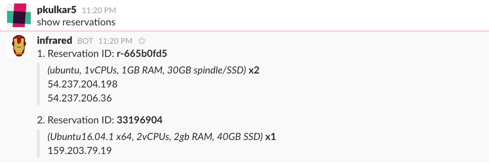

### Set reminder

A lazy programmer who forgets to release resources can set reminders. This will remind the user about his reservations after the specified time. It is also possible to set a reminder for each of the user reservations.

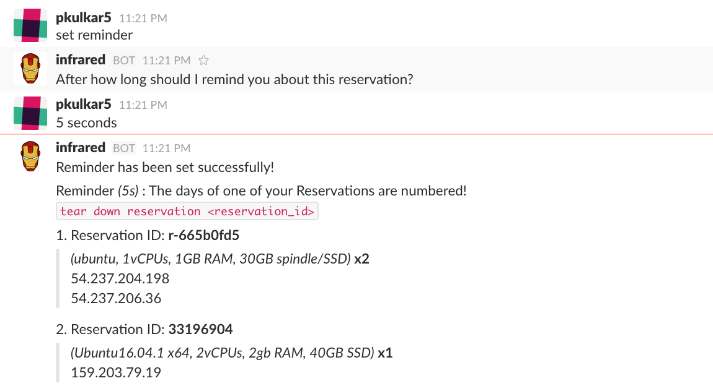

### Save template

This is a very handy way to save commonly used VM/cluster configs as templates without having to type in your requests for future use.

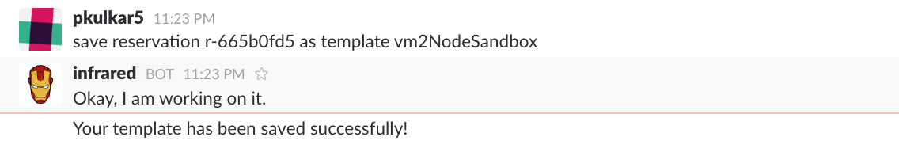

### Create reservation using template

After saving the templates, users can quickly create reservations by just providing the template name.

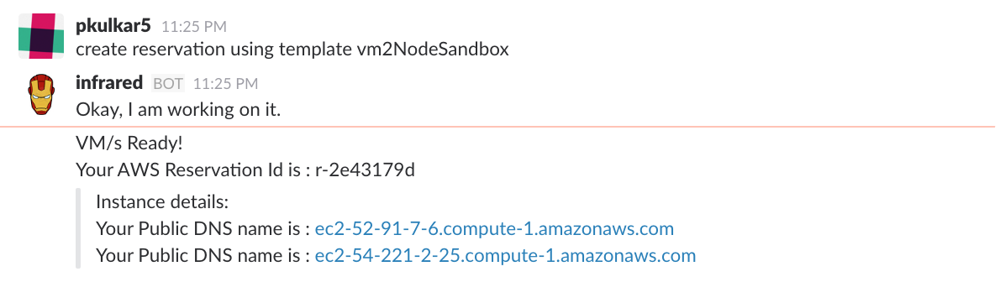

### Show templates

One can view their saved templates with their configuartion parameters.

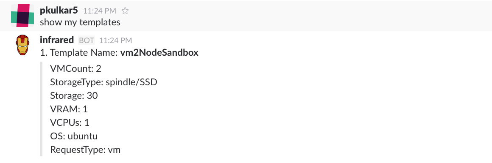

### Terminate reservation

One can tear down a reservation by providing its Reservation Id.

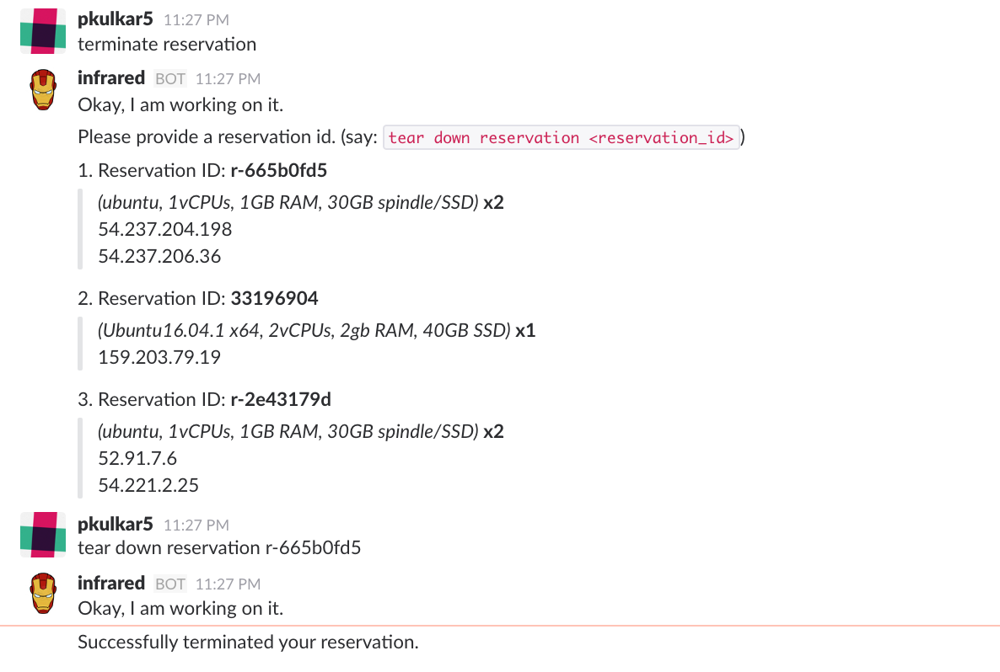

### Create cluster

Users can also request spin up of a cluster by providing its configuration parameters to Infrared. This cluster is  configured with Apache Spark, Zepellin notebook. Cluster creation takes about 8 mins and once ready, user is provided with IP to connect to the cluster and the Zeppelin link where he can write and run Apache Spark code.

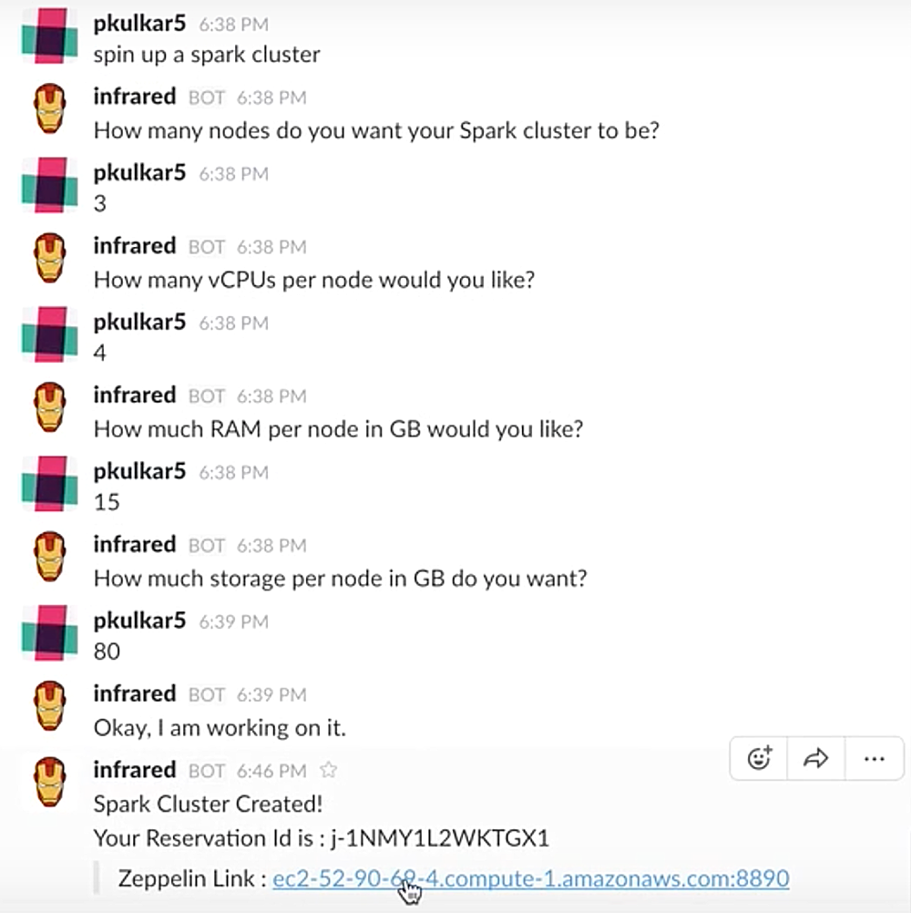

## Your reflection on the development process and project

We followed an **agile process** which incorporated feature driven development and extreme programming techniques. Aspects of which we cover below :

We used Trello for brainstorming, planning, task distribution, scheduling, and tracking. We also used Github Issues for features and bug tracking. We followed behavior driven development style to capture User Stories (Given, when then, Acceptance test criteria) format. This approach helped us clearly define our use-cases and divide them into sub-tasks. The scrum master would assign these Trello boards and Github issues to the team based on strengths and interest of the assignee. A user-story was created for each use-case and after it passed all the acceptance criteria a pull request was created by the owner of the use-case. Having this kind up setup ensured accountability and high productivity.

Our project being a collaborative effort, one of our major design criteria was to make things as modular as possible. As opposed to a single monolithic application which usually becomes very difficult to manage and maintain, we went with a more **service based architecture** design approach to our bot. In our design, our bot application would just be an interface for communication with the client (Slack App) and merely call a provisioning service, thereby abstracting all the logic of provisioning away from the bot. For developing our provisioning service, we followed the REST principles while designing it. We kept our “natural language to intent mapping” solution separate by leveraging the powerful API.AI API. Such separation and abstraction allowed for a more robust solution. The latter was extremely helpful when we needed to change or add new language constructs for our bot later down. 

We adopted **incremental design** approach. Having an initial design in mind we kept ourselves flexible to any future changes.  In the early stages of the project, we used the **“Spike”** approach. This term comes from Extreme Programming (XP), where “A spike solution is a very simple program to explore potential solutions." For instance, initially while architecting our provisioning service, we did not know what API calls are required on AWS/Digital Ocean for VM/Cluster provisioning and what information is returned by them. We needed to prove that a solution around that can be possible. In another instance, we wanted to explore what “natural language to intent mapping” technique would be best for us. Rather than dwelling upon a decision, one would take the initiative and go ahead and code up a spike and prove whether it was the best way to move forward or not. Once identified we would build off that spike. This approach allowed us to be quick in our decision making with respect to our designs and move fast.

Since initially, we did not have the technology skill set required for our project implementation, we relied on a collaborative effort to learn and share acquired knowledge through **pair programming** techniques. This later allowed us to deliver better quality of code as well as be more productive. While submitting code individually a previous pair programmer would perform a quick code review for any logical flaws and also ensure proper coding guidelines were being followed. This further ensured fewer bugs being introduced.

Within our development process, we incorporated a **Continuous Integration** strategy where we would write unit tests for each of our separate use-cases and tasks and be able to test them through Travis CI, which allowed us seamless incremental integration. As an add-on, we also integrated SauceLabs to our continuous integration pipeline. These approaches gave us confidence when we wanted to refactor small or large parts of the code. 

During our weekly meetings, we would have 10 min stand-ups where each assignee would mention the roadblocks or status of the tasks assigned to him. Other members would provide ideas to solve these roadblocks. At times there were differences in ideas and approaches. We carefully negotiated and reasoned them out to choose the best approach like for instance, whether formatting of the returned data should happen at the provisioning service or at the bot end. 

One of the best things throughout our process was that we followed **sprints** consisting of 3 weeks that was set through our Milestone deliverables. Having these intermediary deadlines set for us, allowed our scrum master and our team to maintain a steady rhythm of work thereby allowing us to complete our tasks on time. Within our planning, we were also able to incorporate some slack time which usually involved a game or two of foosball. This not only energized the team but also acted as an opportunity for team bonding.

All in all we had a very positive experience working on the project. The most satisfying thing was that, not only were we able to make a compelling Bot but we did so by following the best SE practices at each stage. We have really come to appreciate the very effective agile software development process by practicing and experiencing it hands-on throughout this project.
	
## Any limitations and future work

For the scope of our project and given our time constraints, we implemented a bot to manage cloud infrastructure, currently supporting just 2 service-providers i.e. AWS and DigitalOcean. Adding support for other providers and even other types of resources (not just compute) would be the next logical step. With this in mind, we made proactive design choices to make sure that our system is modular and the core bot-implementation APIs can easily be repurposed for other tasks in the future.

Also on the bot-implementation side of things, to currently support API-Token management, we are using an un-encrypted data store to store credentials under the impression that the bot is being run only in a strict circle of trust. We could look at exploring end-to-end encryption for message passing and also encryption of the tokens themselves using the unique slack-user identifier as the key, thereby preventing anyone having access to the database from snooping into other user's data.

The pricing engine that we currently have in place follows a simple algorithm to eliminate unfit options (based on user requirements) and pick the cheapest of the available options. We could look at exploring other non-traditional pricing schemes such as AWS’ spot pricing and also consider other parameters such as the average time of reservations of a given user, etc. to build a more comprehensive pricing engine.

And coming to the provisioning-service components, while AWS provides APIs to spin up clusters using Elastic MapReduce, no such service is provided by DigitalOcean. Hence one-click cluster setup through our bot is currently supported only on AWS. To fill this gap, we would need to write Ansible playbooks to set up individual VMs and orchestrate the cluster setup though scripts to achieve the same.

For now, we have deployed our bot on a single cloud based VM using Docker. In order to provide a true internet scale service, we would need to implement continuous monitoring and automatic scale-out features into our deployment pipeline. Along with that we will would need to consider distributed databases (such as Cassandra) as a scalable data stores and the issues that might rise with eventual consistency. 

Since the core-bot logic and the provisioning services themselves are pretty light weight and deal with long-running IO for the most part, node.js is a good fit even at scale. On the other hand, the intent-parsing component of our bot, which is currently being handled by api.ai would need to be bumped up to a paid tier to prevent capping based on the number of API calls we can make. Another alternative would be to replace api.ai with an intent parsing system that is capable of running on prem.

Our Infrared bot is currently available only on Slack. We built InfraRed as a custom integration for our slack team (ATeamNoPlanB), however, we can package our bot user as a Slack app and implement the Slack button to make it simple for any team to install. Moreover, since we use BotKit for communication we can easily extend our bot to other popular messaging platforms like Facebook, Twilio and Microsoft Bot Framework.

## Project Presentation
[Screencast](https://www.youtube.com/watch?v=LAbcjQIwgVk&t=84s)

[Presentation](InfraRed-Presentation.pptx)
